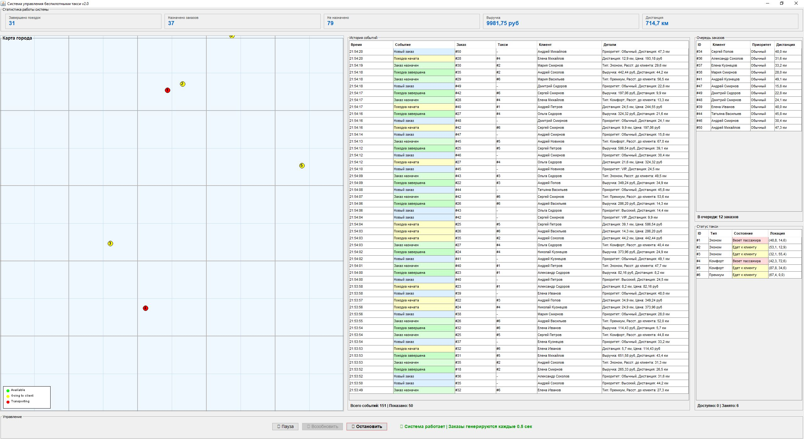

# Система управления беспилотными такси v2.0

Многопоточная система управления парком беспилотных такси с графическим интерфейсом и консольным режимом работы.



## Описание

Проект представляет собой симуляцию работы парка беспилотных такси в городе. Система обрабатывает заказы клиентов в реальном времени, распределяя их между доступными такси по критерию минимального расстояния. Все компоненты работают в многопоточном режиме с использованием механизмов синхронизации Java.

## Технические особенности

### Многопоточность
- **Такси** — каждое работает в отдельном потоке
- **Диспетчер** — асинхронно распределяет заказы
- **Генератор клиентов** — создаёт новые запросы в фоне
- **Потокобезопасные коллекции**: `PriorityBlockingQueue`, `ConcurrentHashMap`
- **Синхронизация**: `ReentrantLock`, `volatile`, `AtomicLong`

### Архитектура

```
src/
├── model/              # Модели данных
│   ├── Point.java      # Координаты на карте
│   ├── RideRequest.java # Заказ клиента
│   ├── TaxiType.java   # Типы такси (Economy/Comfort/Premium)
│   ├── TaxiState.java  # Состояния такси
│   └── HistoryEvent.java # События системы
├── taxi/
│   └── Taxi.java       # Логика работы такси (Runnable)
├── dispatcher/
│   └── Dispatcher.java # Распределение заказов (Runnable)
├── generator/
│   └── ClientGenerator.java # Генерация заказов (Runnable)
├── statistics/
│   ├── Statistics.java # Сбор метрик
│   └── RideHistory.java # История событий
├── ui/                 # Графический интерфейс (Swing)
│   ├── TaxiSystemUI.java
│   ├── CityMapPanel.java
│   ├── HistoryPanel.java
│   ├── OrderQueuePanel.java
│   ├── TaxiListPanel.java
│   ├── StatisticsPanel.java
│   └── ControlPanel.java
└── TaxiSystem.java     # Консольная версия
```

## Функциональность

### Основные возможности
- ✅ Приоритетная обработка заказов (VIP → Высокий → Обычный)
- ✅ Интеллектуальное распределение по ближайшему такси
- ✅ Три типа такси с разными характеристиками:
  - **Economy** — базовая цена 15 руб/км, скорость x1.0
  - **Comfort** — базовая цена 20 руб/км, скорость x1.2
  - **Premium** — базовая цена 30 руб/км, скорость x1.5
- ✅ Визуализация в реальном времени
- ✅ История всех событий системы
- ✅ Статистика работы (поездки, выручка, дистанция)

### GUI функции
- Карта города с движущимися такси
- Цветовая индикация состояний:
  - 🟢 Зелёный — доступен
  - 🟡 Жёлтый — едет к клиенту
  - 🔴 Красный — везёт пассажира
- Живая история событий (последние 50)
- Очередь активных заказов
- Панель управления (Пауза/Возобновить/Остановить)

## Установка и запуск

### Требования
- Java 8+
- ОС: Windows, Linux, macOS

### Быстрый старт (Windows)

```bash
# GUI версия (рекомендуется)
START.bat
```

### Быстрый старт (Linux/macOS)

```bash
chmod +x START.sh
./START.sh
```

### Ручная компиляция и запуск

#### Windows

```bash
# Компиляция
compile.bat

# Запуск GUI
run-ui.bat

# Запуск консольной версии
run.bat
```

#### Linux/macOS

```bash
# Компиляция
chmod +x compile.sh
./compile.sh

# Запуск GUI
chmod +x run-ui.sh
./run-ui.sh

# Запуск консольной версии
chmod +x run.sh
./run.sh
```

### Запуск из командной строки

```bash
# Компиляция
javac -encoding UTF-8 -d bin -sourcepath src src/ui/TaxiSystemUI.java

# GUI версия
java -Dfile.encoding=UTF-8 -cp bin ui.TaxiSystemUI

# Консольная версия
java -Dfile.encoding=UTF-8 -cp bin TaxiSystem
```

## Конфигурация

Основные параметры можно изменить в `TaxiSystem.java` или `TaxiSystemUI.java`:

```java
// Количество такси
ECONOMY_TAXIS = 3
COMFORT_TAXIS = 2
PREMIUM_TAXIS = 1

// Интервал генерации заказов (мс)
CLIENT_GENERATION_INTERVAL_MS = 2000

// Всего заказов (для консольной версии)
TOTAL_REQUESTS = 50
```

